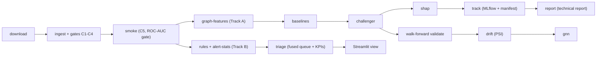

# AML Workbench — Transaction Monitoring & Illicit-Activity Detection

A production-shaped, locally deployable AML transaction-monitoring workbench on
public data — **not** a live banking system. Two tracks:

- **Track A — Elliptic**: real labeled Bitcoin transaction graph (203,769 tx /
  234,355 edges / 165 features / 49 time steps; file-verified — the
  literature's "166 features" does not match the shipped CSV) carrying graph
  features, ML baselines, strict-inductive temporal walk-forward validation,
  and a GNN baseline.
- **Track B — IBM IT-AML HI-Small**: synthetic bank-like data (~5.1M tx / ~518K
  accounts) carrying the rules-based scenario engine, SQL typology analytics,
  alert triage, and operational KPIs.

New to the field? Start with the primers:
[primer-aml-domain.md](docs/primer-aml-domain.md) explains the domain
(laundering stages, regulation, typologies, alert economics);
[primer-ml.md](docs/primer-ml.md) explains the ML concepts used here
(imbalance and metrics, boosting, walk-forward validation, leakage, drift,
SHAP). The [technical report](docs/report.md) holds the results.

## Pipeline



Every stage is a batch command (`uv run aml <stage>`) that consumes and
produces DuckDB tables, parquet, and report artifacts — no in-memory state
between stages. Gate violations exit non-zero before any downstream output is
written.

## Core concepts in five minutes

- **Temporal split only.** Train on labeled Elliptic time steps 1-34, test on
  35-49. Never a random split: at training time the future must not be
  visible.
- **Strict-inductive.** Everything a model sees at an as-of time — features,
  training rows, graph edges — must come from before that time. No
  test-period adjacency enters training or scoring.
- **PR-AUC.** Area under the precision-recall curve; the predeclared
  challenger metric here. ROC-AUC is reported too, but only for comparability
  with published benchmarks.
- **Precision@k.** Share of true hits among the top k alerts of a ranked
  queue. The operational metric a compliance team lives on.
- **PSI.** Population stability index: binned-distribution distance between
  training and test; breach above 0.25, watch in 0.10-0.25.
- Detail on all of these: [primer-ml.md](docs/primer-ml.md).

## Results (honest numbers, predeclared protocol)

Temporal split only, never random; strict-inductive; PR-AUC was declared the
challenger metric before any model was trained. Full details and figures:
[docs/report.md](docs/report.md).

How to read these numbers:

- 0.907 PR-AUC is a benchmark result on a curated public dataset, not a
  deployable detection rate. The labeled base rate is about 9.6% and varies
  by an order of magnitude across time steps, so any score must be read at an
  operating point, not as a single number.
- The micro-F1 caveat applies throughout: at base rates this low,
  micro-averaged F1 flatters a model that misses most illicit activity.
  Per-step precision, recall, and F1 are reported in the technical report.
- GraphSAGE's 0.601 is not evidence that GNNs fail at AML; it is one untuned
  architecture under a strict-inductive protocol, run to check that the
  challenger's win survives the honest comparison.
- On the operational side (Track B), the fused rule+ML queue ranks 221,115
  alerts. Top-500 at 50 USD per investigation yields 3 true positives:
  precision@500 = 0.006, cost per hit approximately 8,333 USD. Those numbers
  are the false-positive economics made explicit; the operating point is an
  assumption, not a calibrated estimate (see Limitations in the report).

## Repository tour

| Path | What lives there |
|---|---|
| `src/aml_workbench/` | Flat modules, one per pipeline stage (`rules.py`, `graph.py`, `model.py`, `triage.py`, ...) |
| `tests/` | One seam-test file per module; tests drive commands, not internals |
| `docs/report.md` + `docs/figures/` | Technical report with regulatory one-pager |
| `docs/primer-aml-domain.md` | Domain primer: laundering stages, regulation (EU AMLR/AMLD6/AMLA, EBA, FFFS), typologies, alert economics |
| `docs/primer-ml.md` | ML primer: metrics, models, validation discipline, drift, SHAP, graph models |
| `docs/rollback-runbook.md` | Restore a known-good state after a bad ingest or model update |
| `data/manifest.json` | Committed checksum manifest (byte-pinned datasets) |
| `app/triage.py` | Thin read-only Streamlit investigator console (`uv run aml view`) |

Figure captions, since the report figures are referenced as artifacts:
`base_rate_curve` shows the illicit share per time step (train vs test side
divided); `walk_forward` shows per-step metric stability under refitting;
`gnn_vs_gbm` plots the two challengers per seed; `drift_psi` ranks features by
PSI against the 0.25/0.10 thresholds; `precision_at_k` is the investigation
yield curve against queue depth.

## Quick start

```bash
uv sync                # install (uv + PEP 621)
uv run aml --help      # list pipeline stages
uv run aml download    # C1: dual-channel dataset download
uv run aml ingest      # C2-C4: checksum gate + typed DuckDB ingest + count gates
uv run aml smoke       # C5: smoke run + one-page report
uv run aml track       # versioned run manifest + MLflow lineage
uv run aml report      # assemble docs/report.md + figures from stage artifacts
uv run aml view        # Streamlit triage console
uv run pytest          # seam tests
```

Optional Kaggle credentials (both datasets are public; credentials are read
from the environment only, never from code or config): copy `.env.example` to
`.env` and set `KAGGLE_USERNAME` / `KAGGLE_KEY` from a free account at
<https://www.kaggle.com/account>.

## Data & licences (terms respected, stated honestly)

| Dataset | Source | Licence | Consequence |
|---|---|---|---|
| Elliptic (Track A) | Kaggle `ellipticco/elliptic-data-set` (primary), PyG mirror `data.pyg.org/datasets/elliptic/` (fallback) | **CC BY-NC-ND 4.0** | Attribution required; **no redistribution** — therefore `data/` is git-ignored and only the checksum manifest (`data/manifest.json`) is committed. Local use only. |
| IBM HI-Small (Track B) | Kaggle `ealtman2019/ibm-transactions-for-anti-money-laundering-aml` | **CDLA-Sharing-1.0** | Derived artifacts shareable with attribution. |

If every download channel for a dataset fails, the pipeline exits non-zero
and stops — no silent substitution of data, ever.

## Limitation statement

Elliptic is real curated Bitcoin data frozen since 2019 (IP-anonymized,
non-recomputable features); HI-Small is AMLSim-synthetic bank-like data.
Neither is representative of a bank's customer-transaction environment. AML Workbench
demonstrates monitoring methods, validation discipline, and controls on
public data.
