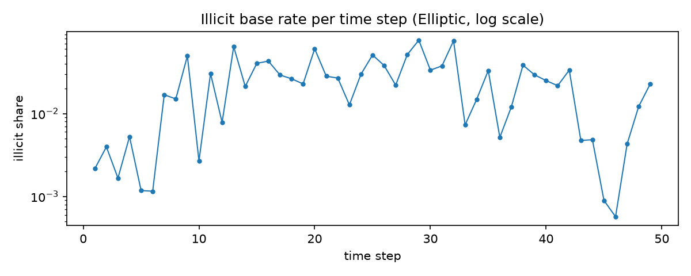
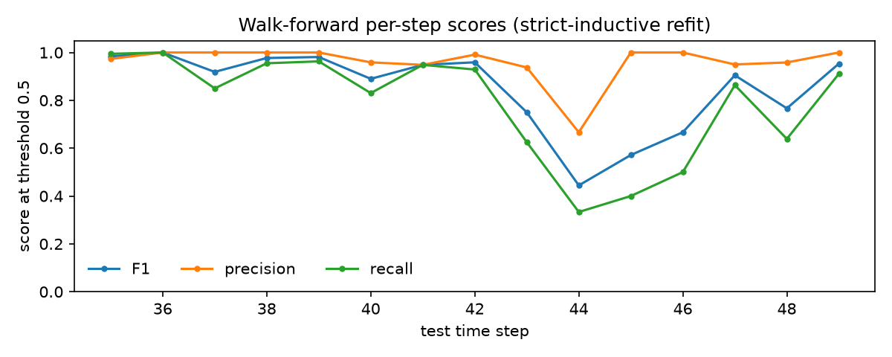
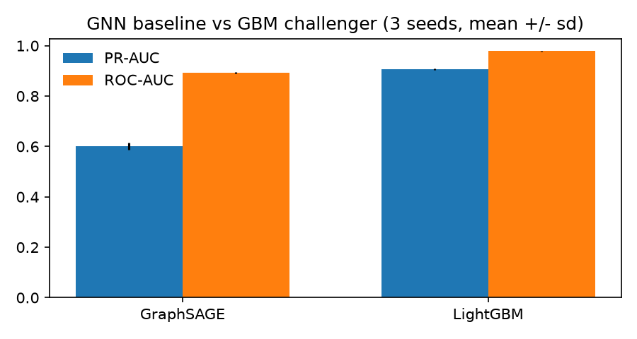
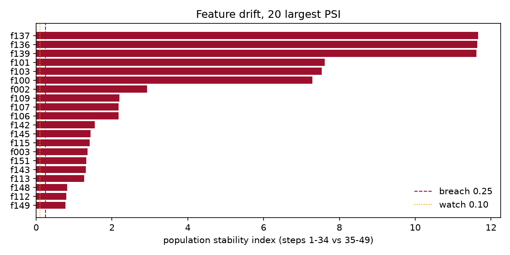
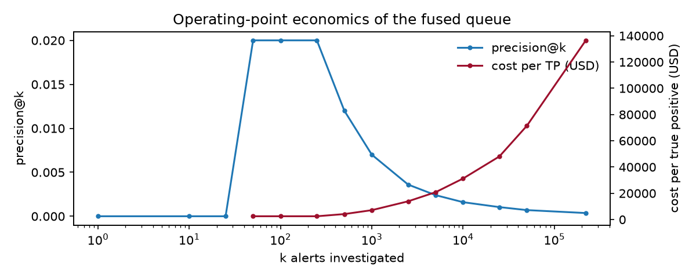
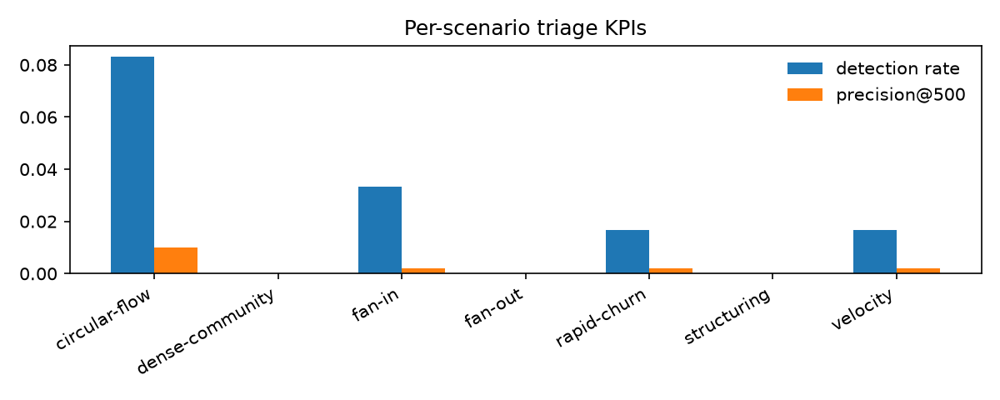

# AML Workbench: technical report

Lineage: commit `a81518ff48ab16ec44a1a51fe868f5d0d37dc660+dirty`, config fingerprint `8fe39d7adcc5`, 28 tracked MLflow runs (`data/reports/run_manifest.json`).

## Scope and claims

This report evaluates an anti-money-laundering (AML) transaction-monitoring workbench built on two public datasets: the Elliptic bitcoin transaction graph (Track A) and the IBM HI-Small synthetic bank transaction data (Track B). It is a reference implementation and a benchmark study. It is not a production system, and none of the numbers here should be read as evidence of performance on live banking data.

## Context for readers new to the field

Two committed primers carry the background this report assumes: [primer-aml-domain.md](primer-aml-domain.md) covers what money laundering is, the regulatory obligations behind transaction monitoring, the typologies the two datasets encode, and the economics of alert triage. [primer-ml.md](primer-ml.md) covers the machine-learning concepts — class imbalance, PR-AUC versus ROC-AUC, gradient boosting, walk-forward validation, leakage discipline, drift and PSI, and SHAP. Read them first if any term below is new; the report itself records results and their caveats, not definitions.

## Data and protocol

The two tracks use one shared, non-negotiable evaluation protocol: temporal splits only, strict-inductive feature computation, and no test-period adjacency during training or scoring. On Elliptic, models train on labeled time steps 1-34 and are tested on labeled steps 35-49; the 157,205 unknown-class transactions appear only as graph context and are never training or scoring targets. On HI-Small, the walk-forward cuts are 2022-09-11 and 2022-09-15, taken from the triage run metadata.

Class imbalance is large and is reported rather than corrected away. The Elliptic labeled base rate is about 9.6% illicit (4,545 of 46,564), and it varies by roughly an order of magnitude across the 49 time steps:

The challenger metric was predeclared as PR-AUC, before any model was trained. ROC-AUC is reported for comparability with prior published benchmarks. Micro-F1 is deliberately not used as a headline number: at a fixed 0.5 threshold, micro-averaged F1 is dominated by the majority class whenever the positive base rate is low, and it can therefore look acceptable while recall on illicit activity is poor. Where F1 appears below, it is computed per time step at the fixed threshold and read alongside precision and recall.

## Models and results

### Baselines and challenger (Track A)

Logistic regression reaches mean PR-AUC 0.2920 and random forest 0.7984 on the temporal test steps (first-seed values; all three seeds are in the metrics artifact). The LightGBM challenger, with hyperparameters selected by a deterministic grid search whose validation slice (steps 31-34) never touches the test side, reaches a mean PR-AUC of 0.9071 across seeds (per-seed 0.9072, 0.9100, 0.9041). The challenger clears the predeclared promotion threshold of +0.01 PR-AUC over the best baseline.

### Walk-forward validation

The challenger is refit at each test step with a strictly expanding training window. Per-step precision, recall, and F1 at the fixed 0.5 threshold stay high through the test window (F1 range 0.444-1.000), but this stability partly reflects the synthetic regularity of Elliptic rather than a property the workbench created; the drift measurements below are the honest check on that.

### GNN baseline

A strict-inductive GraphSAGE baseline (PyG, 3 seeds) reaches mean PR-AUC 0.6009 against the challenger's 0.9071 under the identical protocol. The predeclared verdict was recorded as: GNN loses to the GBM. The GBM on engineered graph features remains the selected model.

### Feature attribution

The SHAP summary over a seeded 20,000-row test subsample is reported in `data/reports/shap_summary.md`. It is referenced, not reproduced here, so that the committed report stays reproducible from the stage artifacts.

### Drift

Population stability index between training and test steps flags 42 features above the 0.25 breach threshold and 98 in the 0.10-0.25 watch band. These are reported as measured: the synthetic data generator shifts several features across the split, which is itself evidence that the temporal protocol is doing its job.

## Operational layer (Track B)

The rules engine and the account model fuse into one ranked alert queue (221,115 alerts after deduplication). At the current operating point of 0.0200 precision at k=100 and 0.0060 at k=500, the queue surfaces 3 true positives in the top 500. The cost-per-true-positive curve makes the false-positive economics explicit for a compliance-team audience.

## Limitations

Stated bluntly, because an interviewer will ask:

1. Synthetic and public data only. HI-Small is generated by IBM's AMLSim; Elliptic is a one-off bitcoin snapshot. Laundering patterns in real bank data differ in volume, label quality, and adversary adaptation. No claim transfers to production monitoring.
2. Label quality. Elliptic's 'illicit' labels are heuristic (from public enforcement sources), incomplete, and static. HI-Small labels are ground truth by construction, which flatters supervised methods.
3. No adversary model. The evaluation is static; a laundering strategy that adapts to the rule thresholds is out of scope.
4. GraphSAGE is a baseline, not a studied architecture. No tuning of the GNN was attempted; the comparison shows the GBM wins under this protocol, not that GNNs are unsuitable for AML.
5. Drift is measured, not mitigated. Features breaching the PSI threshold are reported; no retraining policy, champion-challenger schedule, or monitoring SLA is implemented (see the rollback runbook).
6. The triage operating point (top-k, cost per investigation) is an assumption, not a calibrated estimate from an investigations team.

## Regulatory context (one-pager)

The EU AML package (Regulation (EU) 2024/1624, AMLR, and Directive (EU) 2024/1640, AMLD6) directly obliges credit and financial institutions to run risk-based transaction monitoring, with the AMLR applying from mid-2027 and the new EU Anti-Money Laundering Authority (AMLA) becoming operational around 2025-2026 with direct supervision of selected high-risk entities from 2028. EBA Guidelines EBA/GL/2021/02 require institutions to evidence the effectiveness of their monitoring systems, which is the gap a model like this addresses: scored, ranked, and costed alert queues with measurable detection and false-positive rates. In Sweden, Finansinspektionen's regulations FFFS 2017:11 (and later amendments) transpose equivalent risk-based obligations, including documented monitoring and suspicion reporting. The EU AI Act (Regulation (EU) 2024/1689) does not list AML transaction monitoring as a high-risk use case per se, but if such a system feeds decisions with significant effects on natural or legal persons, institutions should assess AI Act obligations and GDPR Art. 22 (automated decision-making) anyway; this workbench's model-output-is-advisory design (a ranked queue for human investigators, never an automated account decision) is the conservative posture under both regimes. FATF Recommendations 20 and 23 set the international baseline for suspicious transaction reporting that these EU instruments implement.

## Reproduction

Every number above is produced by a batch pipeline command and stored as an artifact; the seam tests assert the report sections and the KPI arithmetic. `aml track` writes the run manifest that ties these artifacts to a code commit and MLflow run ids.

Generated: 2026-09-04 11:28 UTC
